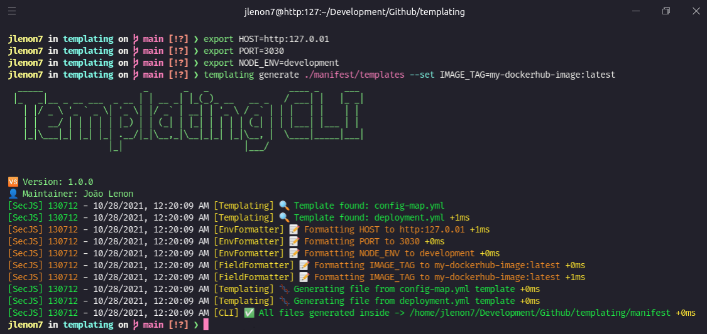
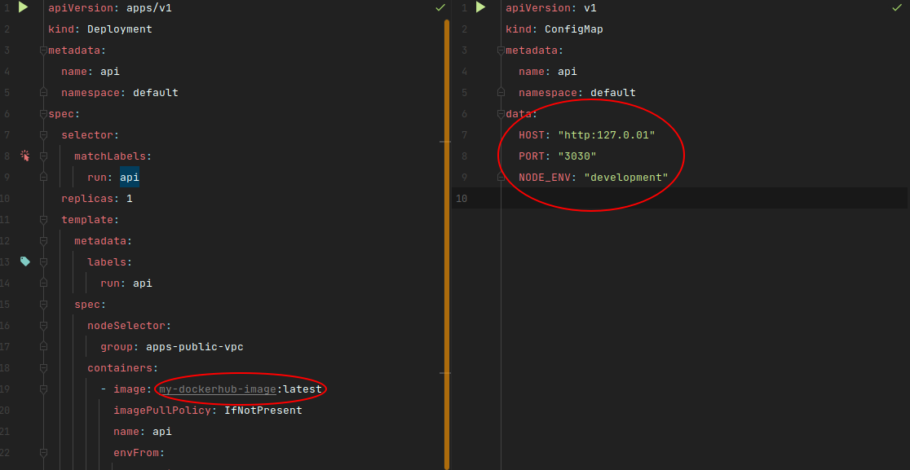

# Templating 📖

> Simple CLI to use inside pipelines to replace stuff inside any type of file

<p>
  

  

  
</p>

Templating is a simple alternative for `Helm template`, but can be used for `any type of file`.


## Installation

```bash
npm install -g @jlenon7/templating
```

## Usage

### Commands 

> Format any string that matches the regex {{ NAME }} in the templates folder path.

> manifest/templates/config-map.yml
```yml
apiVersion: v1
kind: ConfigMap
metadata:
  name: api
  namespace: default
data:
  HOST: "{{ HOST }}"
  PORT: "{{ PORT }}"
  NODE_ENV: "{{ NODE_ENV }}"

```

> manifest/templates/deployment.yml
```yml
apiVersion: apps/v1
kind: Deployment
metadata:
  name: api
  namespace: default
spec:
  selector:
    matchLabels:
      run: api
  replicas: 1
  template:
    metadata:
      labels:
        run: api
    spec:
      nodeSelector:
        group: apps-public-vpc
      containers:
        - image: {{ IMAGE_TAG }}
          imagePullPolicy: IfNotPresent
          name: api
          envFrom:
            - configMapRef:
                name: api
          ports:
            - containerPort: 80
              protocol: TCP
              name: http
          resources:
            limits:
              memory: 500Mi
            requests:
              memory: 500Mi
```

> Templating will always look for environment variables first and then set the local fields.

```bash
templating generate ./manifest/templates --set IMAGE_TAG=my-dockerhub-image:latest
```

---

<p align='center'>
  
</p>

---

<p align='center'>
  
</p>

---

Made with 🖤 by [jlenon7](https://github.com/jlenon7) :wave:
